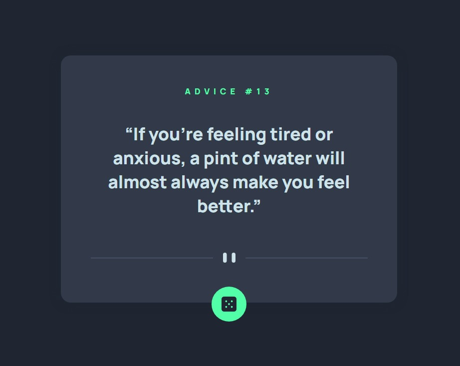

# Frontend Mentor - Advice generator app solution

This is a solution to the [Advice generator app challenge on Frontend Mentor](https://www.frontendmentor.io/challenges/advice-generator-app-QdUG-13db). Frontend Mentor challenges help you improve your coding skills by building realistic projects.

## Table of contents

- [Overview](#overview)
  - [The challenge](#the-challenge)
  - [Screenshot](#screenshot)
  - [Links](#links)
- [My process](#my-process)
  - [Built with](#built-with)
  - [What I learned](#what-i-learned)
  - [Useful resources](#useful-resources)
- [Author](#author)

## Overview

### The challenge

Users should be able to:

- View the optimal layout for the app depending on their device's screen size
- See hover states for all interactive elements on the page
- Generate a new piece of advice by clicking the dice icon

### Screenshot



### Links

- Solution URL: [GitHub](https://github.com/hejkeikei/advice-generator-app)
- Live Site URL: [Live Demo](https://hejkeikei.github.io/advice-generator-app/)

## My process

- Write with semantic markup.
- Plan the layout, and leave a container for DOM element.
- Go through validators.
- Fetch API.
- Display data in DOM.
- Set all root figures and font.
- Responsive design
- Done CSS.

### Built with

- Semantic HTML5 markup
- CSS custom properties
- Flexbox
- Mobile-first workflow
- [Advice Slip JSON API](https://api.adviceslip.com/) - JavaScript library

### What I learned

- Fetch API and place data into HTML

```js
function getAdvice() {
  fetch("https://api.adviceslip.com/advice")
    .then((response) => response.json())
    .then((data) => {
      adviceId.innerHTML = data.slip.id;
      advice.innerHTML = data.slip.advice;
    });
}
```

### Useful resources

- [MDN - Fetch API](https://developer.mozilla.org/en-US/docs/Web/API/Fetch_API)
- [JS: Dot and Bracket Notation](https://frontend.turing.edu/lessons/module-1/js-dot-bracket-notation.html)

## Author

- Codepen - [TingHueiChen](https://codepen.io/TingHueiChen)
- Frontend Mentor - [@hejkeikei](https://www.frontendmentor.io/profile/hejkeikei)
- Twitter - [@hej_keikei](https://twitter.com/hej_keikei)
