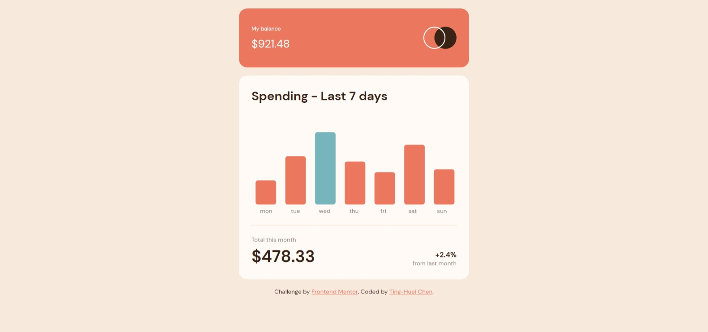

# Frontend Mentor - Expenses chart component solution

This is a solution to the [Expenses chart component challenge on Frontend Mentor](https://www.frontendmentor.io/challenges/expenses-chart-component-e7yJBUdjwt). Frontend Mentor challenges help you improve your coding skills by building realistic projects.

## Table of contents

- [Overview](#overview)
  - [The challenge](#the-challenge)
  - [Screenshot](#screenshot)
  - [Links](#links)
- [My process](#my-process)
  - [Built with](#built-with)
  - [What I learned](#what-i-learned)
  - [Useful resources](#useful-resources)
- [Author](#author)

## Overview

### The challenge

Users should be able to:

- View the bar chart and hover over the individual bars to see the correct amounts for each day
- See the current day’s bar highlighted in a different colour to the other bars
- View the optimal layout for the content depending on their device’s screen size
- See hover states for all interactive elements on the page
- **Bonus**: Use the JSON data file provided to dynamically size the bars on the chart

### Screenshot



### Links

- Solution URL: [GitHub](https://github.com/hejkeikei/expenses-chart-component)
- Live Site URL: [Live Demo](https://hejkeikei.github.io/expenses-chart-component/)

## My process

- Write with semantic markup.
- Plan the layout, and leave a container for DOM element.
- Go through validators.
- Set all root figures and font.
- Responsive design
- Convert JSON file to JS usable object.
- Make the bar chart and tool tips in the container.
- Done detail styling.

### Built with

- Semantic HTML5 markup
- CSS custom properties
- Flexbox
- CSS Grid
- [D3.js](https://d3js.org/) - JavaScript library

### What I learned

I use this challenge to review what I learn from D3 data visulization from freeCodeCamp.

In this challenge we need to make a bar chart, therefore, the task will be giving rectangles different height according to figures:

- Convert JSON into js object variables

```js
const req = new XMLHttpRequest();
req.open("GET", "data.json", true);
req.send();
req.onload = function () {
  const json = JSON.parse(req.responseText);
};
```

- D3.js data entries

```js
var group = svg
  .selectAll("g")
  .data(array)
  .enter()
  .append("g")
  .attr("class", "tip")
  .attr("opacity", "0")
  .attr("x", (d, i) => i * 14.5 + 2 + "%") //after entering data, d3 will do the loop for you
  .attr("y", (d, i) => h - 3 * d - 40);
```

### Useful resources

- [FreeCodeCamp Data Visualization Certificate](https://www.freecodecamp.org/learn/data-visualization/) - This is the place I get to know D3.js and learn the basic.
- [D3 appending text to a svg rectangle](https://stackoverflow.com/questions/20644415/d3-appending-text-to-a-svg-rectangle) - This is an amazing article which helped me finally understand how SVG is different than normal HTML elements and how to group SVG elements with D3.js.

## Author

- Codepen - [TingHueiChen](https://codepen.io/TingHueiChen)
- Frontend Mentor - [@hejkeikei](https://www.frontendmentor.io/profile/hejkeikei)
- Twitter - [@hej_keikei](https://twitter.com/hej_keikei)
