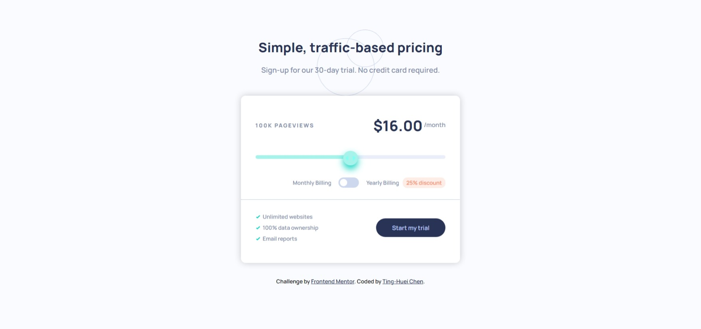

# Frontend Mentor - Interactive pricing component solution

This is a solution to the [Interactive pricing component challenge on Frontend Mentor](https://www.frontendmentor.io/challenges/interactive-pricing-component-t0m8PIyY8). Frontend Mentor challenges help you improve your coding skills by building realistic projects.

## Table of contents

- [Overview](#overview)
  - [The challenge](#the-challenge)
  - [Screenshot](#screenshot)
  - [Links](#links)
- [My process](#my-process)
  - [Built with](#built-with)
  - [What I learned](#what-i-learned)
  - [Useful resources](#useful-resources)
- [Author](#author)
- [Acknowledgments](#acknowledgments)

**Note: Delete this note and update the table of contents based on what sections you keep.**

## Overview

### The challenge

Users should be able to:

- View the optimal layout for the app depending on their device's screen size
- See hover states for all interactive elements on the page
- Use the slider and toggle to see prices for different page view numbers

### Screenshot



### Links

- Solution URL: [Github repository](https://github.com/hejkeikei/hejkeikei.github.io/tree/main/interactive-pricing-component-main)
- Live Site URL: [hejkeikei.github.io](https://hejkeikei.github.io/interactive-pricing-component-main/)

## My process

### Built with

- Semantic HTML5 markup
- CSS custom properties
- Flexbox
- JavaScript
- [Input range slider CSS styler](https://toughengineer.github.io/demo/slider-styler/slider-styler.html)

**Note: These are just examples. Delete this note and replace the list above with your own choices**

### What I learned

JavaScript number formatting:

```js
var number = 16;
number.toFixed(2);
// Output => 16.00
```

How I assign pricing to HTML:

```js
const priceArr = [8, 12, 16, 24, 36];
const viewArr = ["10K", "50K", "100K", "500K", "1M"];

document.getElementById("slider").addEventListener("change", function () {
  let slider = document.getElementById("slider").value;
  let newArr = [];
  if (togg.checked) {
    priceArr.forEach((e) => newArr.push(e * 0.75));
  } else {
    newArr = priceArr;
  }
  traffic.innerHTML = viewArr[slider - 1];
  price.innerHTML = newArr[slider - 1].toFixed(2);
});
```

### Useful resources

- [Flex Order](https://developer.mozilla.org/en-US/docs/Web/CSS/CSS_Flexible_Box_Layout/Ordering_Flex_Items) - This helped me with the layout changes on mobile device.
- [Range sliders](https://www.w3schools.com/howto/howto_js_rangeslider.asp) - This helped me understanding how to customize basic range slider and how to put image on slider's thumb.
- [Input range slider CSS styler](https://toughengineer.github.io/demo/slider-styler/slider-styler.html) - This is an amazing tool that can generate custom sliders with traking progress bar.

## Author

- Codepen - [TingHueiChen](https://codepen.io/TingHueiChen)
- Frontend Mentor - [@hejkeikei](https://www.frontendmentor.io/profile/hejkeikei)
- Twitter - [@hej_keikei](https://twitter.com/hej_keikei)

## Acknowledgments

The slider in the webpage was generated with [Input range slider CSS style generator](https://toughengineer.github.io/demo/slider-styler)(version 20211225)
