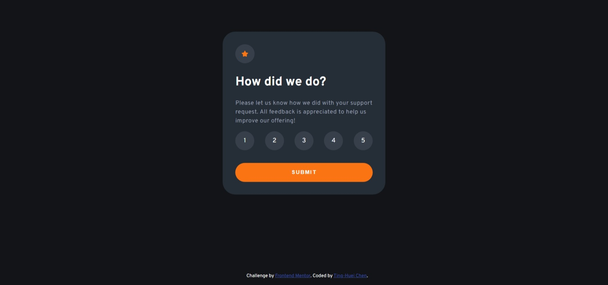

# Frontend Mentor - Interactive rating component solution

This is a solution to the [Interactive rating component challenge on Frontend Mentor](https://www.frontendmentor.io/challenges/interactive-rating-component-koxpeBUmI). Frontend Mentor challenges help you improve your coding skills by building realistic projects.

## Table of contents

- [Overview](#overview)
  - [The challenge](#the-challenge)
  - [Screenshot](#screenshot)
  - [Links](#links)
- [My process](#my-process)
  - [Built with](#built-with)
  - [What I learned](#what-i-learned)
  - [Continued development](#continued-development)
  - [Useful resources](#useful-resources)
- [Author](#author)

**Note: Delete this note and update the table of contents based on what sections you keep.**

## Overview

### The challenge

This challenge is to build out this interactive rating component and get it looking as close to the design as possible.

Users should be able to:

- View the optimal layout for the app depending on their device's screen size
- See hover states for all interactive elements on the page
- Select and submit a number rating
- See the "Thank you" card state after submitting a rating

### Screenshot



### Links

- Solution URL: https://codepen.io/TingHueiChen/pen/eYVWEay

## My process

- Determine which method should I use for the rating feature, since it suppose to retrieve user's feedback, a form sounds a appropriate option.
- Write with semantic markup.
- Get user's input value with JavaScript and show it on the thank you card/page.
- Make sure only the radio button that user select chage colour.
- Get all CSS done, check on both desktop and mobile.
- Go through validators.

### Built with

- Semantic HTML5 markup
- CSS custom properties
- Flexbox
- JavaScript

### What I learned

I loop through all the radio button and pass the iterative object to query selector to dynamically get the option that user select.

```css
.opt {
  display: block;
  position: relative;
  /* Properties below make this object have consist ratio*/
  width: 3rem;
  height: 0;
  padding-bottom: 3rem;
}
```

```js
for (let i of opt) {
  i.addEventListener("click", function () {
    userInput = i.value;
    let rateNum = "label[for=rate" + i.value + "]";
    let optBtn = document.querySelector(rateNum);
    optBtn.style.backgroundColor = "var(--orange)";
    let sib = getSiblings(optBtn);
    for (let i in sib) {
      sib[i].style.backgroundColor = "var(--mediumGreyOp)";
    }
  });
}
```

### Continued development

I would try to go with object oriented way such as event target to select an element in the group.

### Useful resources

- [Prevent page refresh](https://developer.mozilla.org/en-US/docs/Web/API/Event/preventDefault) - This help me prevent page refresh after form submit(since I'm not doing backend here).
- [Example resource 2](https://www.example.com) - This is an amazing article which helped me finally understand XYZ. I'd recommend it to anyone still learning this concept.

## Author

- Codepen - [TingHueiChen](https://codepen.io/TingHueiChen)
- Frontend Mentor - [@hejkeikei](https://www.frontendmentor.io/profile/hejkeikei)
- Twitter - [@hej_keikei](https://twitter.com/hej_keikei)
