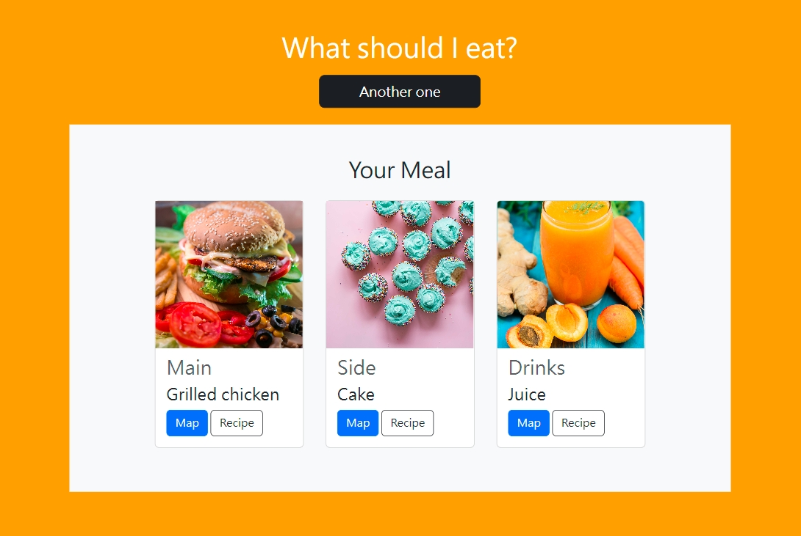

# What Should I eat? - Meal Combination Generator

This is a small application that helps my decidophobia.

### Latest Update

- Single meal combination for breakfast, lunch or dinner.
- Add find restaurant and find recipe features.

## Table of contents

- [Overview](#overview)
  - [Latest Update](#latest-update)
  - [Screenshot](#screenshot)
  - [Links](#links)
- [My process](#my-process)
  - [Built with](#built-with)
  - [What I learned](#what-i-learned)
  - [Continued development](#continued-development)
  - [Useful resources](#useful-resources)
- [Author](#author)
- [Acknowledgments](#acknowledgments)

## Overview

### Screenshot



### Links

- Github repository: [mealCombo](https://github.com/hejkeikei/mealCombo)
- Live Site URL: [What Should I Eat?](https://hejkeikei.github.io/mealCombo/)

## My process

- Plan the features.
- Write with semantic markup.
- Conect to Unsplash API
- Get JavaScript working
- Go through validators.
- Bootstrap class
- Write extra CSS for certain things

### Built with

- Semantic HTML5 markup
- CSS custom properties
- JavaScript
- BootStrap
- Unsplash API

### What I learned

Fetch images form Unsplash API:

```js
function loadImg(meal, searchTerm) {
  let url =
    "https://api.unsplash.com/search/photos/?query=" +
    searchTerm +
    "&client_id=replaceWithAccessKey&per_page=" +
    randomNum;
  fetch(url)
    .then((response) => {
      console.log(response);
      if (response.ok) return response.json();
    })
    .then((data) => {
      const imageNodes = [];
      for (let i = 0; i < data.results.length; i++) {
        imageNodes[i] = document.querySelector("#" + meal + " .imgBox");
        imageNodes[i].style.backgroundImage =
          "url(" + data.results[i].urls.raw + ")";
      }
    });
}
```

### Continued development

- Add filters for special diet such as gluten-free and vegans.
- Improve appearance

### Useful resources

- [Unsplash API](https://unsplash.com/developers)
- [Unsplash API tutorial](https://youtu.be/7QQkl0NLxBQ) - This tutorial helps me understand how to turn the data from API turn into HTML elements.
- [Regular Expression](https://developer.mozilla.org/en-US/docs/Web/JavaScript/Reference/Global_Objects/Promise/then) - This is a article helps me understand JavaScript promise prototype.

## Author

- Codepen - [TingHueiChen](https://codepen.io/TingHueiChen)
- Frontend Mentor - [@hejkeikei](https://www.frontendmentor.io/profile/hejkeikei)
- Twitter - [@hej_keikei](https://twitter.com/hej_keikei)

## Acknowledgments

The load image function was reference from [iamcodefoxx](https://github.com/iamcodefoxx/UnsplashAPI)
