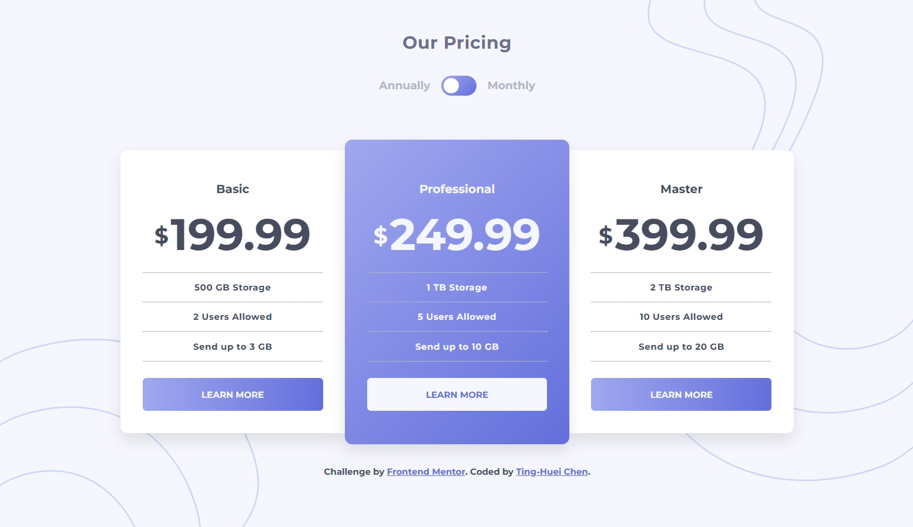

# Frontend Mentor - Pricing component with toggle solution

This is a solution to the [Pricing component with toggle challenge on Frontend Mentor](https://www.frontendmentor.io/challenges/pricing-component-with-toggle-8vPwRMIC). Frontend Mentor challenges help you improve your coding skills by building realistic projects.

## Table of contents

- [Overview](#overview)
  - [The challenge](#the-challenge)
  - [Screenshot](#screenshot)
  - [Links](#links)
- [My process](#my-process)
  - [Built with](#built-with)
  - [What I learned](#what-i-learned)
  - [Continued development](#continued-development)
  - [Useful resources](#useful-resources)
- [Author](#author)
- [Acknowledgments](#acknowledgments)

**Note: Delete this note and update the table of contents based on what sections you keep.**

## Overview

### The challenge

Users should be able to:

- View the optimal layout for the component depending on their device's screen size
- Control the toggle with both their mouse/trackpad and their keyboard
- **Bonus**: Complete the challenge with just HTML and CSS

### Screenshot



### Links

- Solution URL: [Github repository](https://github.com/hejkeikei/pricing-component-with-toggle)
- Live Site URL: [hejkeikei.github.io](https://hejkeikei.github.io/pricing-component-with-toggle-master)

## My process

- Write with semantic markup.
- Set all root figures and font.
- Plan the layout.
- Go through validators.
- Write CSS for general tags.
- Write classes' and ids' style.
- Responsive design
- Get JavaScript working
- Get all CSS done, check on both desktop and mobile.

### Built with

- Semantic HTML5 markup
- CSS custom properties
- Flexbox
- JavaScript

### What I learned

- CSS first-letter pseudo class
  The pseudo class first-letter only works for block element, the property vertical-align only works for inline element. Therefore, I turn my span into inline-block so that both first-letter and vertical-align work/.

```css
span::first-letter {
  font-size: 2rem;
  vertical-align: 0.6rem;
  margin-right: 0.2rem;
}
```

- Foreach and arrow function

```js
array.forEach((e) => (e.style.display = "inline-block"));
```

### Continued development

Complete the challenge with just HTML and CSS

### Useful resources

- [CSS toggles - alvarotrigo](https://alvarotrigo.com/blog/toggle-switch-css/) - This helped me style my toggle prettier.
- [CSS vertical-align](https://developer.mozilla.org/en-US/docs/Web/CSS/vertical-align) - This is an amazing article which helped me finally understand XYZ. I'd recommend it to anyone still learning this concept.

## Author

- Codepen - [TingHueiChen](https://codepen.io/TingHueiChen)
- Frontend Mentor - [@hejkeikei](https://www.frontendmentor.io/profile/hejkeikei)
- Twitter - [@hej_keikei](https://twitter.com/hej_keikei)

## Acknowledgments

Toggle's style was referenced from Alvaro (https://codepen.io/alvarotrigo/pen/abVPyaJ)
